# Modelo Entidad-Relación (MER) - Grade Web App

Este documento describe el Modelo Entidad-Relación deducido del esquema GraphQL de Data Connect.

## 📊 Diagrama ER (Mermaid)

```mermaid
erDiagram
    %% ========================================
    %% GESTIÓN DE USUARIOS
    %% ========================================
    User {
        UUID user_id PK
        String firebase_id
        String name
        String email UK
        String role
        Timestamp created_at
        UUID created_by
        Timestamp updated_at
        UUID updated_by
        Timestamp deleted_at
        UUID deleted_by
    }

    %% ========================================
    %% ESTRUCTURA EDUCACIONAL
    %% ========================================
    LevelCategory {
        UUID category_id PK
        String code UK
        String name
        String description
        Boolean active
        Timestamp created_at
        UUID created_by
        Timestamp updated_at
        UUID updated_by
        Timestamp deleted_at
        UUID deleted_by
    }

    EducationalLevel {
        UUID level_id PK
        UUID category_fk FK
        String code UK
        String name
        String description
        Boolean active
        Timestamp created_at
        UUID created_by
        Timestamp updated_at
        UUID updated_by
        Timestamp deleted_at
        UUID deleted_by
    }

    Subject {
        UUID subject_id PK
        UUID level_fk FK
        String name
        String code
        String description
        Boolean active
        Timestamp created_at
        UUID created_by
        Timestamp updated_at
        UUID updated_by
        Timestamp deleted_at
        UUID deleted_by
    }

    Unit {
        UUID unit_id PK
        UUID subject_fk FK
        String code UK
        String name
        String description
        Boolean active
        Timestamp created_at
        UUID created_by
        Timestamp updated_at
        UUID updated_by
        Timestamp deleted_at
        UUID deleted_by
    }

    Topic {
        UUID topic_id PK
        UUID unit_fk FK
        String code UK
        String name
        String description
        Boolean active
        Timestamp created_at
        UUID created_by
        Timestamp updated_at
        UUID updated_by
        Timestamp deleted_at
        UUID deleted_by
    }

    %% ========================================
    %% CATÁLOGOS DE PREGUNTAS
    %% ========================================
    QuestionType {
        UUID question_type_id PK
        String code
        String name
        String description
        Int min_options
        Int max_options
        Int correct_options
        Boolean active
    }

    Difficulty {
        UUID difficulty_id PK
        String level
        Int weight
        String description
        Boolean active
    }

    Taxonomy {
        UUID taxonomy_id PK
        String code UK
        String name
        String description
        Int level
        Boolean active
        Timestamp created_at
        UUID created_by
        Timestamp updated_at
        UUID updated_by
        Timestamp deleted_at
        UUID deleted_by
    }

    %% ========================================
    %% BANCO DE PREGUNTAS
    %% ========================================
    Question {
        UUID question_id PK
        String text
        Boolean active
        Int version
        UUID original_question_fk FK
        UUID topic_fk FK
        UUID difficulty_fk FK
        UUID taxonomy_fk FK
        UUID question_type_fk FK
        UUID user_fk FK
        Boolean allow_partial_score
        Boolean is_public
        Timestamp created_at
        Timestamp updated_at
        UUID updated_by
        Timestamp deleted_at
        UUID deleted_by
    }

    QuestionOption {
        UUID question_option_id PK
        UUID question_fk FK
        String text
        Boolean is_correct
        Int position
        Float score
    }

    %% ========================================
    %% CURSOS Y ESTUDIANTES
    %% ========================================
    Course {
        UUID course_id PK
        UUID level_fk FK
        UUID user_fk FK
        String name
        String code UK
        String section
        String institution_name
        Boolean active
        Timestamp created_at
        UUID created_by
        Timestamp updated_at
        UUID updated_by
        Timestamp deleted_at
        UUID deleted_by
    }

    Student {
        UUID student_id PK
        String first_name
        String last_name
        String identifier UK
        Timestamp created_at
        UUID created_by
        Timestamp updated_at
        UUID updated_by
        Timestamp deleted_at
        UUID deleted_by
    }

    CourseStudent {
        UUID course_student_id PK
        UUID course_fk FK
        UUID student_fk FK
        Date enrolled_on
        Timestamp created_at
        UUID created_by
        Timestamp updated_at
        UUID updated_by
        Timestamp deleted_at
        UUID deleted_by
    }

    %% ========================================
    %% EVALUACIONES
    %% ========================================
    Evaluation {
        UUID evaluation_id PK
        UUID subject_fk FK
        UUID user_fk FK
        String title
        Date scheduled_date
        Int duration_minutes
        String grade_scale
        String state
        String pdf_path
        Timestamp created_at
        Timestamp updated_at
        UUID updated_by
        Timestamp deleted_at
        UUID deleted_by
    }

    EvaluationQuestion {
        UUID evaluation_question_id PK
        UUID evaluation_fk FK
        UUID question_fk FK
        Float points
        Int position
    }

    CourseEvaluation {
        UUID course_evaluation_id PK
        UUID course_fk FK
        UUID evaluation_fk FK
        Timestamp created_at
        UUID created_by
    }

    %% ========================================
    %% RENDICIONES DE ESTUDIANTES
    %% ========================================
    StudentCourseEvaluation {
        UUID student_evaluation_id PK
        UUID course_evaluation_fk FK
        UUID course_student_fk FK
        Float total_score
        Float grade
        Timestamp taken_on
        Int attempt_no
        String state
    }

    StudentEvaluationQuestion {
        UUID student_evaluation_question_id PK
        UUID student_evaluation_fk FK
        UUID evaluation_question_fk FK
        Int position
        Float score_obtained
        Boolean is_correct
    }

    StudentAnswerOption {
        UUID student_answer_option_id PK
        UUID student_evaluation_question_fk FK
        UUID question_option_fk FK
    }

    %% ========================================
    %% RELACIONES
    %% ========================================
    
    %% Estructura Educacional
    LevelCategory ||--o{ EducationalLevel : "contiene"
    EducationalLevel ||--o{ Subject : "tiene"
    EducationalLevel ||--o{ Course : "pertenece a"
    Subject ||--o{ Unit : "contiene"
    Unit ||--o{ Topic : "contiene"

    %% Preguntas
    Topic ||--o{ Question : "pertenece a"
    Difficulty ||--o{ Question : "tiene"
    Taxonomy ||--o{ Question : "clasificada por"
    QuestionType ||--o{ Question : "es de tipo"
    User ||--o{ Question : "crea"
    Question ||--o{ Question : "versión de"
    Question ||--o{ QuestionOption : "tiene"

    %% Cursos y Estudiantes
    User ||--o{ Course : "gestiona"
    Course ||--o{ CourseStudent : "tiene"
    Student ||--o{ CourseStudent : "inscrito en"

    %% Evaluaciones
    Subject ||--o{ Evaluation : "evalúa"
    User ||--o{ Evaluation : "crea"
    Evaluation ||--o{ EvaluationQuestion : "contiene"
    Question ||--o{ EvaluationQuestion : "incluida en"
    Course ||--o{ CourseEvaluation : "tiene"
    Evaluation ||--o{ CourseEvaluation : "asignada a"

    %% Rendiciones
    CourseEvaluation ||--o{ StudentCourseEvaluation : "rendida por"
    CourseStudent ||--o{ StudentCourseEvaluation : "rinde"
    StudentCourseEvaluation ||--o{ StudentEvaluationQuestion : "contiene"
    EvaluationQuestion ||--o{ StudentEvaluationQuestion : "responde"
    StudentEvaluationQuestion ||--o{ StudentAnswerOption : "selecciona"
    QuestionOption ||--o{ StudentAnswerOption : "opción elegida"
```



---

## 📋 Descripción de Entidades

### 🔐 Gestión de Usuarios

| Entidad | Descripción | Tabla |
|---------|-------------|-------|
| **User** | Usuarios del sistema (Admin, Coordinator, Teacher) | `users` |

### 🏫 Estructura Educacional

| Entidad | Descripción | Tabla |
|---------|-------------|-------|
| **LevelCategory** | Categorías de niveles (Básica, Media, etc.) | `level_categories` |
| **EducationalLevel** | Niveles educacionales específicos (1° Básico, 2° Medio) | `educational_levels` |
| **Subject** | Asignaturas (Matemáticas, Lenguaje, etc.) | `subjects` |
| **Unit** | Unidades de una asignatura | `units` |
| **Topic** | Temas dentro de una unidad | `topics` |

### 📚 Catálogos de Preguntas

| Entidad | Descripción | Tabla |
|---------|-------------|-------|
| **QuestionType** | Tipos de pregunta (TF, SC, MC) | `question_types` |
| **Difficulty** | Niveles de dificultad (Easy, Medium, Hard) | `difficulties` |
| **Taxonomy** | Taxonomía de Bloom (Remember, Understand, Apply, etc.) | `taxonomies` |

### ❓ Banco de Preguntas

| Entidad | Descripción | Tabla |
|---------|-------------|-------|
| **Question** | Preguntas del banco de preguntas | `questions` |
| **QuestionOption** | Opciones de respuesta para cada pregunta | `question_options` |

### 👥 Cursos y Estudiantes

| Entidad | Descripción | Tabla |
|---------|-------------|-------|
| **Course** | Cursos (1° Básico A, 2° Medio B) | `courses` |
| **Student** | Estudiantes | `students` |
| **CourseStudent** | Inscripción de estudiantes en cursos (N:M) | `course_students` |

### 📝 Evaluaciones

| Entidad | Descripción | Tabla |
|---------|-------------|-------|
| **Evaluation** | Evaluaciones/Pruebas | `evaluations` |
| **EvaluationQuestion** | Preguntas asignadas a una evaluación (N:M) | `evaluation_questions` |
| **CourseEvaluation** | Asignación de evaluaciones a cursos (N:M) | `course_evaluations` |

### ✅ Rendiciones de Estudiantes

| Entidad | Descripción | Tabla |
|---------|-------------|-------|
| **StudentCourseEvaluation** | Rendición de un estudiante en una evaluación | `student_evaluations` |
| **StudentEvaluationQuestion** | Respuesta de un estudiante a una pregunta | `student_evaluation_questions` |
| **StudentAnswerOption** | Opciones seleccionadas por el estudiante (soporta MC) | `student_answer_options` |

---

## 🔗 Relaciones Principales

### Jerarquía Educacional
```
LevelCategory (1) ──► (N) EducationalLevel (1) ──► (N) Subject (1) ──► (N) Unit (1) ──► (N) Topic
```

### Banco de Preguntas
```
Topic ◄── Question ──► QuestionType
              │
              ├──► Difficulty
              ├──► Taxonomy
              ├──► User (creador)
              └──► QuestionOption (1:N)
```

### Flujo de Evaluaciones
```
Evaluation ──► EvaluationQuestion ◄── Question
     │
     └──► CourseEvaluation ◄── Course
                │
                └──► StudentCourseEvaluation ◄── CourseStudent ◄── Student
                            │
                            └──► StudentEvaluationQuestion ◄── EvaluationQuestion
                                        │
                                        └──► StudentAnswerOption ◄── QuestionOption
```

---

## 📊 Cardinalidades

| Relación | Cardinalidad | Descripción |
|----------|--------------|-------------|
| LevelCategory → EducationalLevel | 1:N | Una categoría tiene múltiples niveles |
| EducationalLevel → Subject | 1:N | Un nivel tiene múltiples asignaturas |
| Subject → Unit | 1:N | Una asignatura tiene múltiples unidades |
| Unit → Topic | 1:N | Una unidad tiene múltiples temas |
| Topic → Question | 1:N | Un tema tiene múltiples preguntas |
| Question → QuestionOption | 1:N | Una pregunta tiene múltiples opciones |
| Course ↔ Student | N:M | Mediante `CourseStudent` |
| Evaluation ↔ Question | N:M | Mediante `EvaluationQuestion` |
| Course ↔ Evaluation | N:M | Mediante `CourseEvaluation` |
| StudentCourseEvaluation → StudentEvaluationQuestion | 1:N | Una rendición tiene múltiples respuestas |
| StudentEvaluationQuestion → StudentAnswerOption | 1:N | Soporta selección múltiple (MC) |

---

## 🏷️ Tipos de Pregunta Soportados

| Código | Nombre | Opciones | Correctas |
|--------|--------|----------|-----------|
| **TF** | True/False | 2 | 1 |
| **SC** | Single Choice | 2-6 | 1 |
| **MC** | Multiple Choice | 2-6 | 1-N |

La tabla `StudentAnswerOption` permite almacenar múltiples selecciones para preguntas de tipo **MC** (Multiple Choice).

---

## 🔒 Soft Delete

La mayoría de las entidades implementan **soft delete** mediante los campos:
- `deleted_at`: Fecha de eliminación
- `deleted_by`: Usuario que realizó la eliminación

---

## 📅 Auditoría

Las entidades principales incluyen campos de auditoría:
- `created_at`: Fecha de creación
- `created_by`: Usuario que creó el registro
- `updated_at`: Fecha de última actualización
- `updated_by`: Usuario que actualizó el registro
